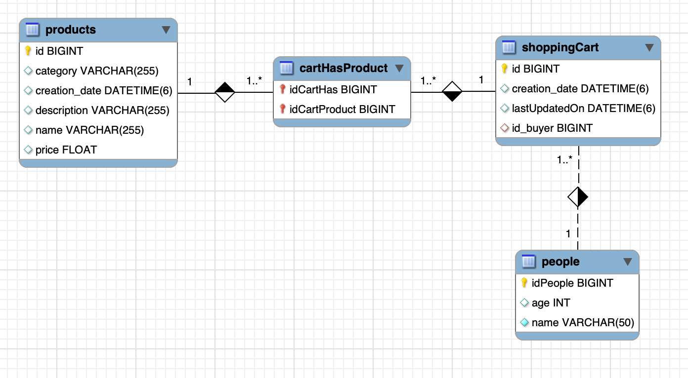

# 1. Completing our Spring project

Let's go to complete our project started in latter week:



Create a new project and add this three classes from last week project.

# 2. DTO

DTO leeds to Data Transfer Object, and there are objects used to get and receive information, avoiding to show how information is stored in real database. It provide a way to _obfuscate_ and _protect_ data.

Starting from `Product` class in model, create a `ProductDTO` class, with same attributes:

```java
	private Long id;
	private String name;
	private String description;
	private String category;
	private float price;
	private LocalDateTime creationDate;
```

Create static methods to:

- `	public static ProductDTO fromModel2DTO(Product product)`
- `	public static Product fromDTO2Model(ProductDTO productDTO)`
- `	public static List<ProductDTO> fromModel2DTO(List<Product> productos)`

> Take into account that, when creating new objects, neither `id` nor `creationDate` is needed.

# 3. Accessing data

## 3.1. Repository

Create a repository for `Products` defining a single interface extending a `JPARepository`

## 3.2. Service

Create a service with methods to:

```java
ProductDTO saveProduct(ProductDTO productoDTO);
ProductDTO getProductById(Long id);
List<ProductDTO> listAllProducts();
void deleteProduct(Long id);
```

> **Attention**:
> 
> - Remember than, due to in these methods you only see `ProductDTO`, is your service who has the responsibility to transform between Model and DTO classes.
> - You can program with FACADE pattern design, separating method definition in a `ProductService` interface and implementing in `ProductServiceImpl` class.


# 4. Controller

Add a new controller to your project, mapping next requests. Obviously, they must call to service's methods:

- `GET http://localhost:9090/products`
- `GET http://localhost:9090/products/1/`
- `POST http://localhost:9090/products/ {JSON OBJECT}`
- `PUT http://localhost:9090/products/ {JSON OBJECT}`
- `DELETE http://localhost:9090/products/1/`

> In delete method, you must return to the client the deleted Product

# 5. Testing our webapp 

Here you will find some test request, implemented in [curl](https://reqbin.com/curl). If you prefer, you can do it in Postman.

```sh
curl --location 'http://localhost:9090/products' \
--header 'Content-Type: application/json' \
--data '{
    "category":"Electronics",
    "description":"Pantalla plana UHD 4K",
    "name":"TV Xiaomi VHT",
   "price":560.34
}'

curl --location 'http://localhost:9090/products' \
--header 'Content-Type: application/json' \
--data '{
    "category":"Games",
    "description":"Last generation Xbox console",
    "name":"XBOX Series X",
   "price":893.23
}'

curl --location 'http://localhost:9090/products' \
--header 'Content-Type: application/json' \
--data '{
    "category":"Games",
    "description":"La mejor consola de Sony",
    "name":"Playstation 5",
   "price":1023.23
}'

curl --location 'http://localhost:9090/products' \
--header 'Content-Type: application/json' \
--data '{
    "category":"Home",
    "description":"Cama hinchable 2.5",
    "name":"InflaBed",
   "price":43.45
}'
````

## 5.1. GET request

```sh
curl --location 'http://localhost:9090/products/1/
curl --location 'http://localhost:9090/products/14/
curl --location 'http://localhost:9090/products/
```

## 5.2. 4.3 PUT

Add a new dummy product:

```
curl --location 'http://localhost:9090/products' \
--header 'Content-Type: application/json' \
--data '{
    "category":"Dummy",
    "description":"dummy 2.5",
    "name":"Dummy",
   "price":100
}'
```

check the response and get its ID:

```json
{
  "id":5,
  "name":"Dummy",
  "description":"dummy 2.5",
  "category":"Dummy",
  "price":100.0,
  "creationDate":"2023-05-13T09:03:45.13622"}
```

Create this put request, changing any filed value

```sh
curl --location --request PUT 'http://localhost:9090/products' \
--header 'Content-Type: application/json' \
--data '{
  "id":5,
  "name":"Dummy",
  "description":"dummy 7.5",
  "category":"Dummy",
  "price":100.0,
  "creationDate":"2023-05-13T09:03:45.13622"}'
```
and check the response


## 5.3. Delete

curl --location --request DELETE 'http://localhost:9090/products/7/' 